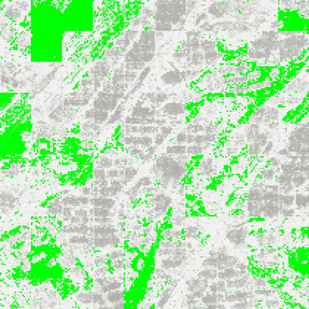

# urban_seg [english](README_en.md)

这个项目是一个面向新手的基于遥感图片的语义分割项目。
我们使用了在**4亿**张图片上进行预训练的unicom模型，这个模型非常高效，在遥感分割任务上表现优异。
令人惊讶的是，我们仅仅使用了**4**张遥感图片进行训练，就能够获得非常好的效果。  
如果您想快速开始，可以使用 `train_one_gpu.py` 来启动训练，这是个简易的代码，只有200行。
但如果您追求更好的性能，可以尝试使用稍微复杂一些的代码 `train_multi_gpus.py`，该代码支持多GPU训练。

请注意，`train_multi_gpus.py` 可能需要一些额外的配置和设置，以便正确地运行多GPU训练。确保在使用之前仔细阅读代码中的说明和文档，以确保正确设置和配置。

<table>
  <tr>
    <td></td>
    <td></td>

  </tr>
  <tr>
    <td></td>
    <td></td>
  </tr>
</table>

<!--   -->


## 安装

```bash
git clone https://github.com/anxiangsir/urban_seg.git
```

### 安装依赖
```bash
pip install -r requirements.txt
```

### 数据和预训练模型

CCF卫星影像的AI分类与识别提供的数据集初赛复赛训练集，一共五张卫星遥感影像

[百度云盘](https://pan.baidu.com/s/1LWBMklOr39yI7fYRQ185Og)，密码：3ih2

```
dataset
├── origin //5张遥感图片，有标签
├── test   //3张遥感图片，无标签，在这个任务中没有用到
└── train  //为空，通过`python preprocess.py`随机采样生成
    ├── images       
    └── labels
FP16-ViT-B-32.pt
FP16-ViT-B-16.pt
FP16-ViT-L-14.pt
FP16-ViT-L-14-336px.pt
```

### 一张GPU训练

1. 下载数据集到当前目录 
2. 预处理数据  
```bash
python preprocess.py
```
3. 训练
```bash
python train_one_gpu.py
```

### 八张GPU训练
1. 下载数据集到当前目录 
2. 预处理数据  
```bash
python preprocess.py
```
3. 训练
```
torchrun --nproc_per_node 8 train_multi_gpus.py
```


## 和我们讨论反馈
QQ群：679897048


## 引用我们
如果你觉得这个项目对你有用，欢迎引用我们的论文
```
@inproceedings{anxiang_2023_unicom,
  title={Unicom: Universal and Compact Representation Learning for Image Retrieval},
  author={An, Xiang and Deng, Jiankang and Yang, Kaicheng and Li, Jiawei and Feng, Ziyong and Guo, Jia and Yang, Jing and Liu, Tongliang},
  booktitle={ICLR},
  year={2023}
}
```
